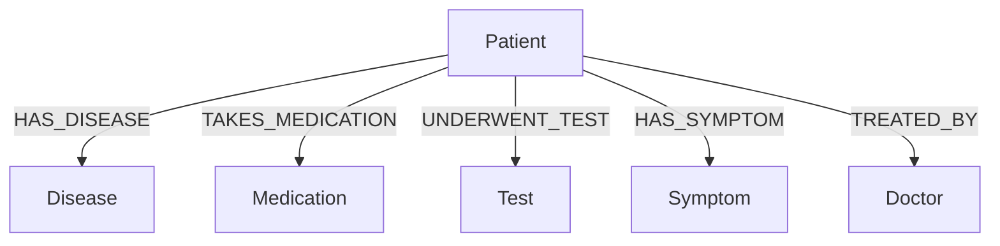

# NeoGraph: Realtime GraphRAG Application

A Streamlit application that combines Neo4j graph database with LangChain and OpenAI to create queryable knowledge graphs from PDF documents.

## Technologies Used

- **Frontend**: Streamlit
- **Database**: Neo4j Graph Database
- **AI/ML**: 
  - OpenAI GPT-4 & Embeddings
  - LangChain for RAG implementation
- **Document Processing**: PyPDF Loader
- **Vector Search**: Neo4j Vector Index

## Schema



## Quick Start

1. Install dependencies:
```bash
pip install -r requirements.txt
```

2. Run the application:
```bash
streamlit run app.py
```

3. Configure:
   - Add OpenAI API key
   - Connect Neo4j database
   - Upload PDF and start querying

## Features

- PDF to Knowledge Graph conversion
- Natural language querying
- Vector similarity search
- Real-time graph visualization
- Medical domain-focused schema

